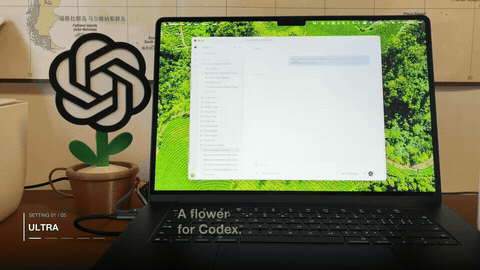

# Rotating Flower

A small physical status indicator for local Codex work. On a Mac, a Python bridge watches local Codex task state and sends serial commands to an ESP32-C3. A stepper motor spins while a task runs, changes among five speed presets with the reasoning setting, and stops when the task finishes. When several local tasks run at once, the bridge selects the highest active preset.

**This is an independent, personal, non-commercial DIY prototype. It is not affiliated with, sponsored by, or endorsed by OpenAI.** The OpenAI mark shown on the purchased decorative piece in the demo belongs to OpenAI. This repository does not include that piece's 3D model or grant any right to use the mark.

[](https://raw.githubusercontent.com/dalaofei1154/codex-rotating-flower/main/publish-assets/rotating-flower-demo-en-60s.mp4)

**[▶ View or download the full 60-second English demo](https://raw.githubusercontent.com/dalaofei1154/codex-rotating-flower/main/publish-assets/rotating-flower-demo-en-60s.mp4)** · [Step-by-step build guide](docs/build-guide-en.md) · [中文说明](README.md)

The demonstration shows the working electronics and software prototype. The decorative flower body is a purchased part; this repository teaches the control method and does not contain a printable flower enclosure.

```text
Local Codex task records → macOS Python bridge → USB serial → ESP32-C3 → ULN2003 → 28BYJ-48
```

## What you need

| Part | Quantity |
| --- | ---: |
| Mac running local Codex tasks | 1 |
| ESP32-C3 SuperMini board | 1 |
| ULN2003 stepper driver board | 1 |
| 5 V 28BYJ-48 five-wire stepper motor | 1 |
| Female-to-female jumper wires | 6 |
| USB-C **data** cable | 1 |

The ESP32-C3 is the microcontroller; no additional controller board is required. The motor's five-pin plug connects directly to the ULN2003. The current build uses a 1:16 motor and has been observed working for short runs. Other gear ratios produce different output speeds. Arduino IDE with the ESP32 board package is needed to upload the firmware; the Mac bridge needs Python 3.9 or newer and uses only the standard library.

## Quick start

Follow the [full build guide](docs/build-guide-en.md) for wiring and safety checks. With the USB cable **disconnected**, wire the ESP32-C3 to the ULN2003:

| ESP32-C3 | ULN2003 |
| --- | --- |
| `5V` | `+` |
| `G` / `GND` | `-` |
| `GPIO4` | `IN1` |
| `GPIO5` | `IN2` |
| `GPIO6` | `IN3` |
| `GPIO7` | `IN4` |

Verify the printed pin labels, voltage, and polarity on your own boards before connecting power. This USB-powered arrangement has only been tested briefly with the listed prototype. A different motor, heavier load, or separate supply needs a fresh power review and a shared ground.

1. Open [`m0/motor_control/motor_control.ino`](m0/motor_control/motor_control.ino) in Arduino IDE. Select the board and port that match your ESP32-C3, then upload it. The build was tested with Espressif Arduino-ESP32 core 3.3.11.
2. In the serial monitor at **115200 baud**, send `PING` and check for `PONG`. Send `RUN LOW` to check that the motor turns, then `STOP`. Close the serial monitor before starting the Python bridge.
3. From the repository root, run:

   ```sh
   python3 m1/global_bridge.py --once
   python3 m1/global_bridge.py
   ```

   `--once` reports the detected task state without opening USB. The regular command searches serial ports for a device that replies to `PING`. If needed, pass `--port /dev/cu.usbmodemXXXX` using the **actual** port on your Mac. Press Ctrl+C to stop the bridge and send `STOP`.

4. Once manual operation works, you can optionally install the bridge as a macOS user service with `python3 m1/install_macos.py install`. See [`m1/README.md`](m1/README.md) for update, removal, and log instructions.

## Scope and limitations

- The included firmware, bridge, installer, and tests are the reproducible part of this project. The current Mac bridge finds the current user's `CODEX_HOME` (default `~/.codex`) and probes for the USB device; it does not contain the author's home path or a fixed serial port.
- The bridge reads Codex's **internal local transcript format**, which [OpenAI's Hooks documentation](https://learn.chatgpt.com/docs/hooks) says is not a stable interface. Retest after Codex updates. This implementation covers local and worktree tasks on a Mac, not cloud tasks or Windows. See [Codex environments](https://learn.chatgpt.com/docs/environments/modes).
- Preset labels represent firmware step intervals, not independently measured RPM. Long-duration use, other motors, and different loads need their own validation.
- The bridge reads local state events and sends USB serial commands. It does not need an OpenAI API key or send conversation content to a project server. **Never commit your own Codex session files, private logs, or credentials.**

To port this design, first make your computer send `PING`, `RUN LOW`, and `STOP` to the ESP32 over serial. Then provide a reliable source for task start and finish events in your Codex environment. Add effort-to-speed mapping only when a reliable effort signal is available. A two-state “running / stopped” version is a valid starting point.

## Tests and license

```sh
python3 -m unittest discover -s m1 -p 'test_*.py' -v
```

Code is available under [MIT](LICENSE); written documentation is under [CC BY 4.0](https://creativecommons.org/licenses/by/4.0/legalcode). The demo video and third-party mark are outside those grants. Read [`LICENSES.md`](LICENSES.md) for the exact scope, and [`CONTRIBUTING.md`](CONTRIBUTING.md) before opening an issue or pull request.
