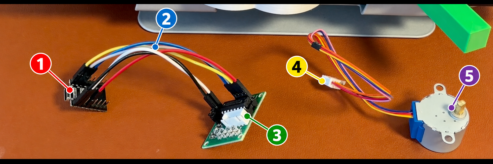
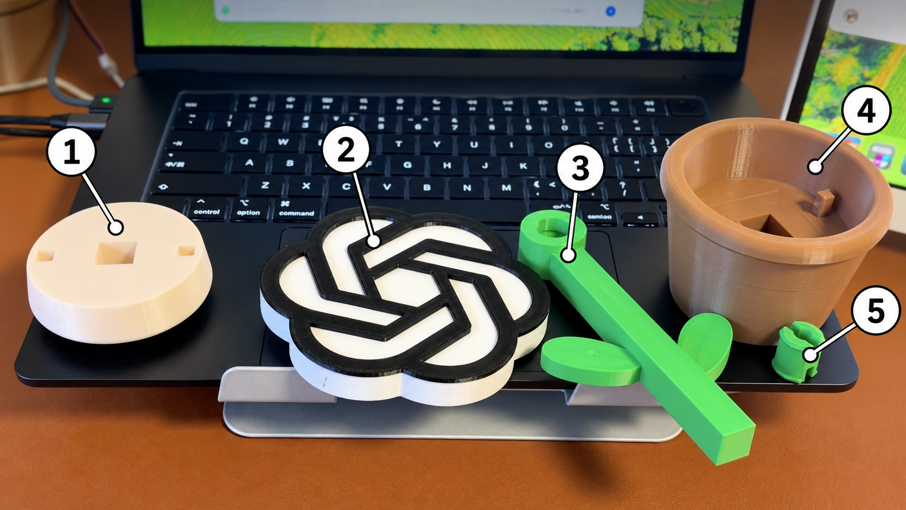

# Codex 旋转花

[English](README.md) · **简体中文**

我做了一朵桌面小花：Codex 工作时它会转动，任务结束就停下。在我的 Mac 上，调高推理强度，它也会转得更快。

[](https://raw.githubusercontent.com/dalaofei1154/codex-rotating-flower/main/publish-assets/rotating-flower-demo-en-60s.mp4)

**[观看或下载完整的 60 秒英文视频](https://raw.githubusercontent.com/dalaofei1154/codex-rotating-flower/main/publish-assets/rotating-flower-demo-en-60s.mp4)** · [从零搭建教程](docs/从零搭建.md)

这个仓库教你让**电机跟着 Codex 的任务状态转动**：里面有 ESP32 程序，也有连接 Codex 和电机的 Mac 程序。视频中的花朵装饰件是买来的，仓库没有可打印的花朵模型。你可以换成自己的装饰件，也可以先让电机轴转起来。

> 这是我的个人非商业 DIY 项目，与 OpenAI 没有合作、赞助或官方关联。视频中购买的装饰件带有 OpenAI 标志；仓库不提供该装饰件的模型，也不授予标志使用权。[查看许可说明](LICENSES.md)。

## 它怎么工作？

```text
本地 Codex 任务 → Mac 上的 Python 程序 → USB 数据线 → ESP32-C3 → 电机驱动板 → 电机
```

Python 程序读取**本机** Codex 任务记录。任务开始时，它让 ESP32 带动电机；任务结束时让电机停下。如果同时运行多个任务，就采用其中最高的速度档位。

## 需要准备什么？

| 材料 | 数量 |
| --- | ---: |
| 运行本地 Codex 任务的 Mac | 1 台 |
| ESP32-C3 SuperMini 开发板 | 1 块 |
| ULN2003 电机驱动板 | 1 块 |
| 5 V 28BYJ-48 五线步进电机 | 1 个 |
| 母对母杜邦线 | 6 根 |
| USB-C **数据线** | 1 根 |



图中 **1** 是 ESP32-C3 控制板，**2** 是连接两块板的 6 根母对母杜邦线，**3** 是 ULN2003 驱动板，**4** 是电机自带的五线线束和白色插头，**5** 是 5 V 步进电机。**照片里的白色插头尚未插入驱动板**，试转前要插进驱动板的白色插座。Mac 和 USB-C 数据线没有拍进这张近照。照片用于认配件；接线时以板上的丝印和[教程中的接线表](docs/从零搭建.md#2-接线)为准。

ESP32-C3 就是控制器，不需要另买一块单片机。电机自带的五针插头直接插到 ULN2003 上。还需要 Arduino IDE 上传程序，以及 Mac 上的 Python 3.9 或更新版本；Python 程序不用安装第三方包。

我的原型使用约 1:16 减速比的电机，做过短时测试。换电机或装更重的花朵，效果可能不同。

### 可选的花朵外观件

电机不装花朵也能运行。下图是视频中**购买的成品配件**；你也可以换成适合自己电机和固定方式的装饰。



图中 **1** 是白色圆形件，**2** 是花头，**3** 是花茎和叶片，**4** 是花盆，**5** 是绿色小连接件。这些名称仅帮助辨认外观，不代表精确尺寸或装配说明。**仓库不提供这些配件的 CAD、STL、STEP 或其他 3D 打印模型。**花头带有第三方 OpenAI 标志，详见[许可说明](LICENSES.md)。

## 先让它转起来

[从零搭建教程](docs/从零搭建.md)有更完整的接线、安装和排错步骤。建议先不装花朵，只测试电机。

1. **拔掉 USB 再接线。** `5V → +`、`G/GND → -`，`GPIO4–7 → IN1–IN4`，顺序一一对应。通电前核对你手上的开发板和驱动板标识，以及电机铭牌是否为 5 V。
2. **上传固件。** 用 Arduino IDE 打开 [`m0/motor_control/motor_control.ino`](m0/motor_control/motor_control.ino)，选择与你的 ESP32-C3 相符的板型和串口，然后上传。我使用 Espressif Arduino-ESP32 core 3.3.11 测试过。
3. **手动试转。** 在 115200 波特率的串口监视器发送 `PING`，应收到 `PONG`；再发送 `RUN LOW`，最后发送 `STOP`。运行 Python 程序前，先关闭串口监视器。
4. **在仓库根目录运行 Mac 程序：**

   ```sh
   python3 m1/global_bridge.py --once
   python3 m1/global_bridge.py
   ```

   第一条命令只显示识别到的任务状态，不连接电机。第二条命令保持运行，再启动一个**本地** Codex 任务。按 Ctrl+C 会发送 `STOP` 并退出。如果自动找不到串口，用 `--port /dev/cu.usbmodemXXXX` 指定你电脑上的实际端口。

手动测试成功后，可以[设置为登录 Mac 后自动运行](m1/README.md)。

## 别人能直接用吗？

使用相近的硬件，可以先试仓库中的 [ESP32 固件](m0/motor_control/motor_control.ino)和 [Mac 程序](m1/global_bridge.py)。程序没有写死我的用户名或 USB 端口：它从你自己的 `CODEX_HOME`（默认 `~/.codex`）找任务记录，通过 `PING`／`PONG` 找开发板。

连接 Codex 的这部分依赖一种**可能变化的本地文件格式**。升级 Codex 后如果失效，需要修改读取任务记录的部分。当前版本还没有适配云端任务或 Windows。换硬件或环境时，[教程](docs/从零搭建.md#5-哪些部分可以复用)说明了要改哪些地方。也可以先做一个简单版：任务运行时转，结束时停。

五个速度档位对应程序设定的步进间隔，**不是实测转速**。长期连续运行，以及不同电机和负载，还没有完整测试。[查看测试记录](debug_log.md)。

程序只读取本地任务状态，并通过 USB 发命令；不需要 OpenAI API 密钥，也不会把对话内容发送到本项目的服务器。请勿把自己的 Codex 任务文件、日志或密钥上传到 GitHub。

## 测试和许可

在仓库根目录运行软件测试：

```sh
python3 -m unittest discover -s m1 -p 'test_*.py' -v
```

代码采用 [MIT](LICENSE)，教程文字采用 [CC BY 4.0](https://creativecommons.org/licenses/by/4.0/legalcode)。**视频、照片和第三方标志不在这两种许可范围内。** 详见 [LICENSES.md](LICENSES.md) 和 [CONTRIBUTING.md](CONTRIBUTING.md)。
